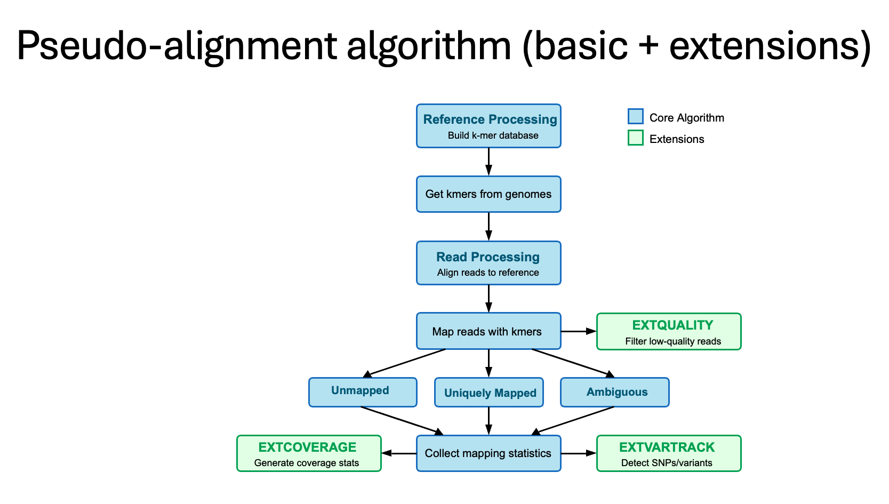

# Genomic Pseudo-Aligner

A Python bioinformatics tool for genomic pseudo-alignment, variant calling (SNPs), and coverage analysis.

## 🚀 Features

* **Pseudo-Alignment:** Efficient mapping using k-mer indexing and counting.
* **Quality Control (EXTQUALITY):** Filters low-quality reads and k-mers based on Phred33 scores before alignment.
* **Coverage Analysis (EXTCOVERAGE):** Generates detailed statistics on unique vs. ambiguous mapped reads per position.
* **Variant Tracking (EXTVARTRACK):** Identifies specific one-base differences (SNPs) between reads and reference genomes.

## 🛠️ System Architecture

| Module | Description |
| :--- | :--- |
| `aligner.py` | Core class that manages the alignment process and accumulates status (unique/ambiguous/unmapped). |
| `kmers.py` | Handles `Reference` genomes and the `KmerCollection` index. |
| `extcoverage.py` | Calculates coverage depth and statistics for mapped positions. |
| `extvartrack.py` | Tracks base changes to identify variants based on quality and coverage thresholds. |
| `main.py` | The main script that handles command-line arguments and delegates work to the other modules. |

## 📊 Algorithm Design

The pipeline follows a structured flow from reference indexing to variant detection:



## 🧬 Variant Detection (SNP)

The tool detects Single Nucleotide Polymorphisms (SNPs) by comparing aligned reads to the reference. It looks for positions where the read base differs from the reference, provided the quality score and coverage meet the thresholds.

For example:

```text
Reference Genome:  ... A  T  C  G  [T]  A  G  C ...
                       |  |  |  |   X   |  |  |
Aligned Read:      ... A  T  C  G  [A]  A  G  C ...
                                    ^
                               SNP Detected
```

## 💡 Key Design and Coding Decisions

* **Decorators for I/O:** Custom decorators (`@handle_f_read`, `@handle_f_write`) were implemented to improve error handling across file operations, keeping the code clean.
* **Encapsulation:** Extensions (Coverage, Variant Tracking) are isolated in their own modules/classes to minimize dependencies and allow the core `Aligner` to remain lightweight and simple.
* **O(1) Lookups:** `KmerCollection` uses Hashmaps (Python dictionaries) for constant-time lookups of k-mers, while maintaining a separate list to preserve genome order for output consistency.

## 💻 Usage Examples
* Note: The commands below use example filenames. Please replace them with your own data.

### 1. Basic Alignment
Align reads to a reference genome and save the result to an `.aln` file.

```bash
python3 main.py -t align \
  -g example_ref_mid.fa \
  -k 12 \
  -a output.aln \
  --reads s_example_k150_n10k.fq
```

### 2. Alignment with Quality Filtering & Variant Detection
Run the pipeline with specific quality thresholds and enable the variant tracker.

```bash
python3 main.py -t dumpalign \
  -g reference_for_vartrack.fa \
  -k 5 \
  --reads reads_for_vartrack.fq \
  --detect-variants \
  --min-variant-coverage 1 \
  --min-variant-quality 20
```

### 3. Coverage Statistics
Analyze the coverage of an existing alignment.

```bash
python3 main.py -t dumpalign \
  -g example_ref_mid.fa \
  -k 12 \
  --reads s_example_k150_n10k.fq \
  --coverage
```

## 🛠️ Development & Testing
To run the comprehensive test suite, install dependencies and run pytest:

```bash
pip install -r requirements.txt
python3 -m pytest
```

## ⚠️ Algorithm Limitations
As a pseudo-aligner, this tool is designed for speed and coverage estimation, not exact alignment. 
* **Indels:** It does not handle Insertions or Deletions (gaps). It assumes perfect contiguous k-mer matches.
* **Heuristic:** The mapping is based on k-mer voting only.